# Composition and alerts of the Peruvian Financial System

# SUMMARY
The purpose of this repository is to explore the Peruvian financial system: how large it is in terms of asset size, what types of institutions it comprises, whether each subsystem has a characteristic structure, and the geographic distribution of their loans and deposits across the country. It also highlights key alerts related to the performance and quality of financial institutions.

It is important to mention that the Peruvian financial system is regulated by the Superintendence of Banking, Insurance and Pension Funds (SBS). Among the main entities it supervises are Banks, Finance Companies (Financieras), Municipal Savings and Loans (Cajas Municipales), and Rural Savings and Loans (Cajas Rurales).

The first analysis focuses on the structure and main characteristics of the system, offering an initial overview of the Peruvian financial system. The subsequent geographic analysis will allow us to assess whether credit issuance and deposit collection are concentrated in specific areas or distributed more evenly throughout the country. This could serve as a starting point for a more in-depth evaluation of financial inclusion and policy design to enhance inclusion in certain regions.

Finally, the analysis of key risk indicators such as the capital adequacy ratio and default ratio (morosidad) will help assess the financial health of institutions and identify significant differences across subsystems. This analysis is crucial for regulators to detect early warning signs and apply prudential measures to entities exhibiting high risk levels. The study will also look at the behavior of these indicators in institutions that have experienced crises or have been closed by the SBS.

# INPUT DATA
The primary source of information for this project was the Superintendencia de Banca, Seguros y AFPs (SBS) of Peru. All data related to financial system entities was obtained from this website. Additionally, population data by region was extracted from the Instituto Nacional de Estadística e Informática (INEI). Finally, a shapefile of the map of Peru was obtained from The Humanitarian Data Exchange platform.

## 1. Superintendencia de Banca, Seguros y AFPs (SBS)
1.1. Most of the published data was not available in CSV format but rather in Excel files. Therefore, a Python script was created to automatically download these Excel files from the SBS website, clean the data, and convert it into dataframes for analysis and calculations. The data retrieved using this approach includes:

* Balance sheet (Asset and Liability Structure) for each institution as of December 2024:

   - B-2201-di2024.xlsx (Banking institutions)
   - B-3101-di2024.xlsx (Financial companies)
   - C-1101-di2024.xls (Municipal Savings and Loans - CMACs)
   - C-2101-di2024.xls (Rural Savings and Loans - CRACs)

* Details of each type of loan by entity as of December 2024:

    - B-2359-di2024.xls (Banking institutions)
    - B-3272-di2024.xlsx (Financial companies)
    - C-1261-di2024.xls (CMACs)
    - C-2264-di2024.xls (CRACs)

* Loans and Deposits by Geographic Area granted by each subsystem (Banks, Financial Companies, CMACs, and CRACs) as of December 2024:

    - B-2314-di2024.xlsx (Banking system)
    - B-3254-di2024.xlsx (Financial companies system)
    - C-1213-di2024.xls (CMACs system)
    - C-2213-di2024.xls (CRACs system)

1.2 The SBS also provides some data in CSV format. This includes risk indicators for each entity, in this case the default ratio and capital ratio. Monthly data was downloaded from January 2016 to September 2022. The following steps were used to obtain the files: Go to www.sbs.gob.pe → Estadísticas y Publicaciones → Estadísticas → Series Estadísticas, select Sistema Financiero, choose monthly frequency, select “Entity-level” information, then choose Indicadores Financieros, expand the options, and select "Ratio de Capital Global" and "Morosidad". Then, select the active institutions (in black; red indicates inactive entities). Some inactive institutions were also included to illustrate and analyze the elevated risk levels they presented before ceasing operations.

- The downloaded files were renamed as follows:
    - risk_indicators_b.csv (Banks)
    - risk_indicators_f.csv (Financial companies)
    - risk_indicators_cm.csv (CMACs)
    - risk_indicators_cr.csv (CRACs)

## 2. Instituto Nacional de Estadística e Informática (INEI)

The published data was also in Excel format, so the same Python script used for SBS files was applied here. The data extracted was:

- Estimated population by department for 2024–2025 (2024 values were used):
    - proy_04_4.xls

## 3. The Humanitarian Data Exchange

The shapefile used to map Peru’s boundaries was downloaded from the following URL: https://data.humdata.org/dataset/cod-ab-per. The file downloaded was:

- per_adm_ign_20200714_shp.zip 

# SCRIPTS
The analysis was conducted using Python version 3.12 (Spyder), and the project includes four scripts. Additionally, QGIS was used to generate map visuals.
The scripts and the .qgz file are executed as follows:

## 1. download_data.py

This script must be run first, as it contains the necessary instructions to download the data that serves as input for the subsequent scripts. This data corresponds to information on financial institutions available on the SBS website. The files downloaded are Excel files containing December 2024 data, including the following (as detailed in the previous “Inputs” section): Balance Sheet, Detailed Credit Types by Entity, and Direct Loans and Deposits by Geographic Area for each subsystem.
The same script was used to download population data by geographic area from the INEI website.

## 2. filter_structure.py
-This script first reads and cleans the previously downloaded Balance Sheet and credit type detail files for each entity, as they are not in dataframe format. It then filters the necessary Balance Sheet items (Assets and Liabilities) for all entities. This filtering is performed separately for Banks, Financial Companies, CMACs, and CRACs, since each subsystem’s data is stored in separate files with unique formats.

-A similar process is followed to clean and filter credit type details for each entity, also organized in four separate files by subsystem. These are then merged with the Balance Sheet data filtered in the previous step for each subsystem.

-The next step is to concatenate the data from all four subsystems into a single dataframe containing the full balance sheet (assets and liabilities) for all financial institutions.

Output: A CSV file named `fs_structure.csv`

-Additional calculations are performed to: Count the number of institutions per subsystem, compute the percentage share of the total assets of each subsystem and each entity, and analyze the balance sheet structure of each subsystem, specifically: The share of each asset category relative to total assets, the share of each liability category relative to total liabilities
These insights help identify if there are structural differences across subsystems.

Outputs: The following five figures were generated:
`Type_entities.png`, `share.png`, `Top_10.png`, `assets_structure.png`, `liability_structure.png`

## 3. fiter_zones.py
-This script first reads and cleans the Excel files containing Loans and Deposits by Geographic Area for each subsystem, which are not in dataframe format. It filters the data to extract regions and total loans and deposits granted to each region. This filtering is performed separately for Banks, Financial Companies, CMACs, and CRACs, since each subsystem’s data is stored in separate files with some unique formats.

-A similar cleaning and filtering process is applied to the Excel file containing the total population by region.

-Then, the script merges the credit and deposit data from all four subsystems with the regional population data.

Output: A CSV file named `byzones.csv`

-It performs calculations to determine: Total loans and deposits by region, loan amount per person in each region, and deposit amount per person in each region. These metrics are used to create visualizations (heatmaps and scatter plots) for further analysis.

Outputs: The following four figures were generated:
`heatmap_loans.png`, `heatmap_deposits.png`, `loan_perpop.png`, `Dep_perpop.png`

## 4. map_pop.qgz
-QGIS was used to plot a map of Peru and show the relationship between the total population of each region and the total loans granted by each subsystem. This helps analyze whether there is geographic diversification or concentration, and whether credit granting behavior varies by subsystem. The same analysis was done for deposits.

-Inputs included the shapefile of Peru, specifically the "per_admbnda_adm1_ign_20200714.shp" file from the "per_adm_ign_20200714_shp.zip" zip file, and the "byzones.csv" file generated from the previous script. A join was performed using the region name as the key.

Outputs: The following eight figures were generated:
`map_loan_b.png`, `map_loan_cm.png`, `map_loan_cr.png`, `map_loan_f.png`,
`map_dep_b.png`, `map_dep_cm.png`, `map_dep_cr.png`, `map_dep_f.png`

## 5. ratios.py
-This script reads CSV files directly downloaded from the SBS website containing information on capital ratios and default ratios for financial institutions. As there is one file per subsystem, a column was added to each to indicate the corresponding subsystem type.

-The data from the four subsystems was then concatenated into a single comprehensive dataframe.

Output: A CSV file named `ratios_comb.csv`

-Calculations were performed to determine percentiles of the default ratio, allowing for an assessment of average default risk across subsystems.

-Boxen plots were generated to visualize the capital ratio distribution among financial institutions grouped by subsystem (Bank, Financial Comp, CMAC, CRAC). The same was done for the distribution of the default ratio.

Outputs: The following two figures were generated: `boxenplot_capital.png`, `boxenplot_default.png`

-Finally, a line chart was created to show the trend of the default ratio for a specific entity, to illustrate its risk level and evolution over time.

Output: the following figure were generated `entity_default.png`

# RESULTS

## 1. From de script: "filter_structure.py"

## 1.1  Structure and participation
These figures illustrate the structure of the Peruvian Financial System, which is composed of four subsystems: Banks (17 entities), Finance Companies (11), Municipal Savings and Loans (CMACs, 9), and Rural Savings and Loans (CRACs, 8), totaling 42 entities. The banking system is by far the largest, holding nearly 90% of the total assets of the Financial System, followed by the CMAC subsystem.

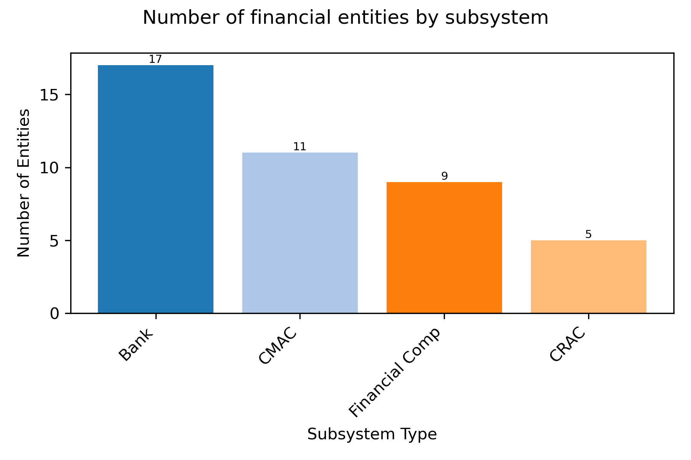 

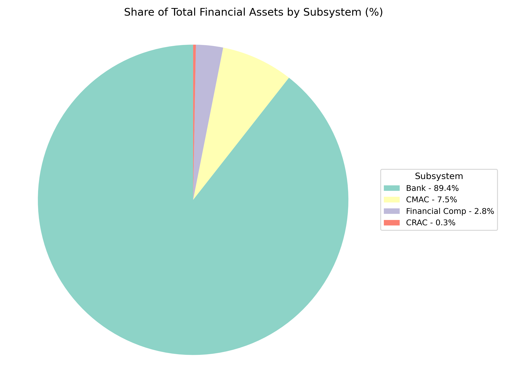

## 1.2 Top 10 entities 
The figure on the largest financial institutions shows that 8 out of the top 10 entities in terms of total assets are banks. The exceptions are two Municipal Savings and Loans—Arequipa, ranked 7th, and Huancayo, ranked 10th. These CMACs play a significant role in the financial system and are even larger than some banks.

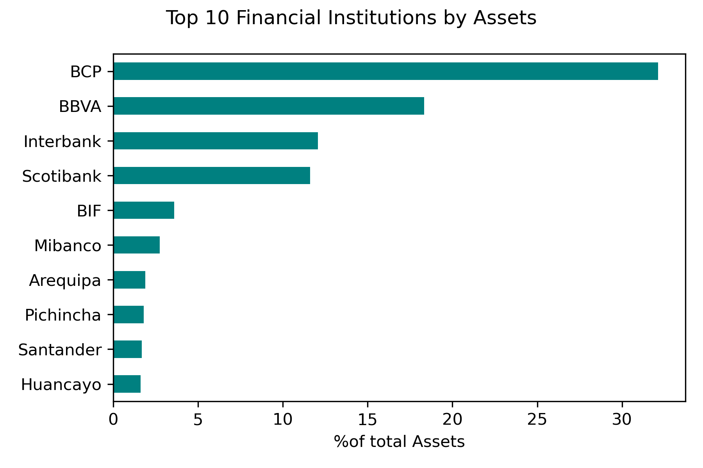 

## 1.3 Assets Structure
The asset structure chart reveals distinct and important characteristics of each subsystem. One notable feature is that banks hold a significantly larger investment portfolio than the other subsystems, which represents greater regulatory oversight in terms of market and investment risks. Furthermore, baks primarily provide corporate loans and mortgages. In contrast, the other subsystems focus heavily on lending to small businesses and consumer credit.

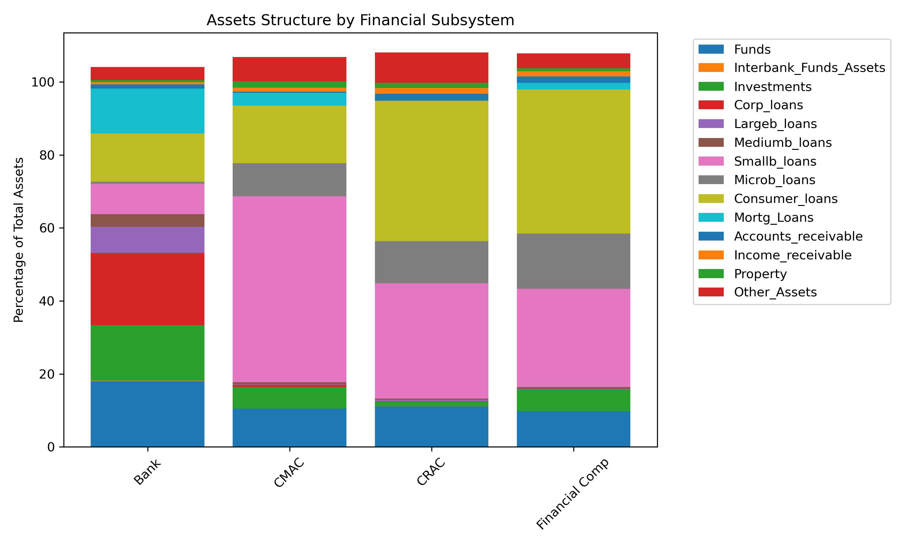 

## 1.4. Liability Structure

The liability structure chart also highlights specific traits of each subsystem that are crucial for assessing the risk levels of their operations. Unlike the others, banks have substantial funding from demand deposits, which generally come from institutional clients such as corporations, insurance companies, pension fund administrators (AFP), and investment funds. Banks also rely significantly on savings and time deposits. For CMACs, CRACs, and Finance Companies, their main funding sources are savings and time deposits, which typically come from individuals—referred to as retail deposits. This type of retail funding is considered highly stable due to its atomized and diversified nature (smaller amounts distributed across many depositors), and it tends to be less volatile, as individual depositors generally react more slowly to market news compared to institutional investors.

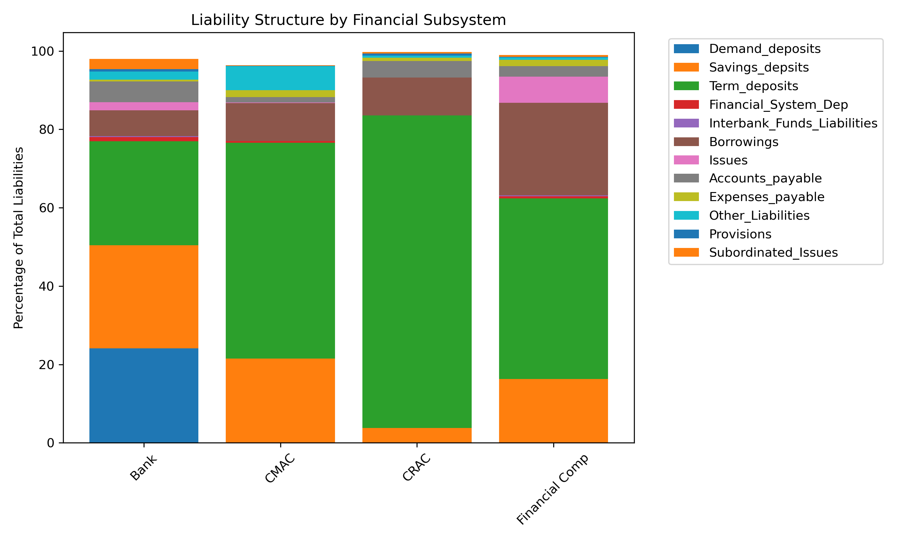

## 2. From de sript "fiter_zones.py" and "map_pop.qgz"

## 2.1 Heatmaps

The credit heatmap illustrates the degree of concentration in credit allocation by each subsystem in each region. It shows that Banks, Finance Companies, and CRACs are primarily concentrated in Lima (the capital of Peru). In the case of banks, this may be explained by their focus on corporate and large-scale lending, as most large enterprises are based in Lima. By contrast, CMACs demonstrate a broader regional distribution, with higher credit volumes in Lima, Arequipa, Cusco, Junín, and Puno. This is because CMACs are institutions established by local municipalities and typically have their headquarters in those respective geographic areas.

The deposit heatmap reflects a similar concentration pattern in Lima, followed by regions such as Arequipa, Callao, La Libertad, and Piura.

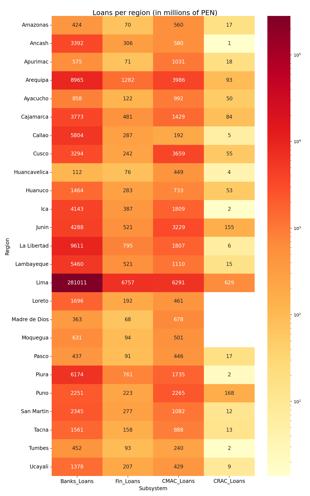

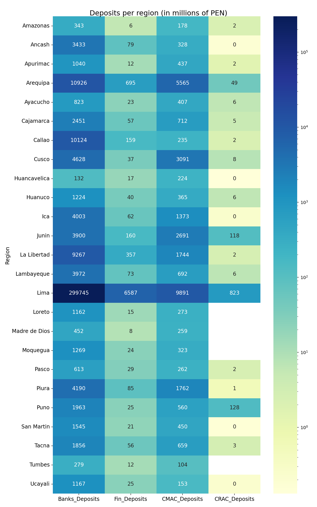

## 2.2 Loans and deposits per person

The loan scatter chart shows the amount of credit per person in each region. This was calculated by dividing the total amount of credit granted in a region by the total population of that region (regardless of the number of accounts or credit types). When making a cross-regional comparison, the regions with the lowest per capita credit levels include Amazonas, Ayacucho, Huancavelica, Loreto, and Tumbes. In contrast, Lima stands out with a significantly higher per capita credit amount of approximately 26,000 soles.

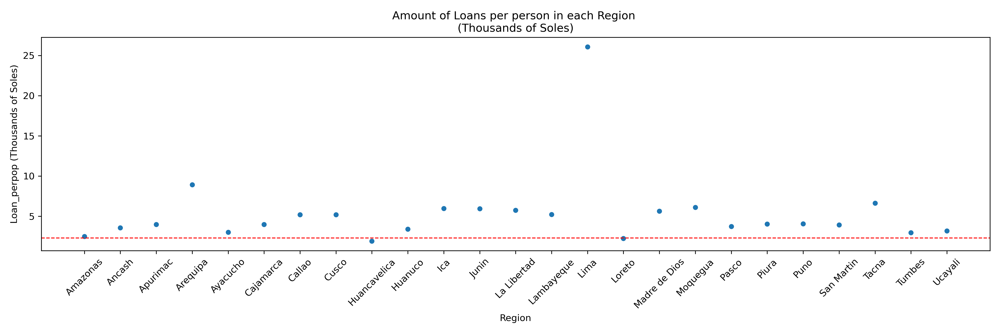

Similarly, the deposit chart reflects the per capita deposit amounts in each region, calculated by dividing the total amount of deposits (in soles) by the population of the corresponding region (also independent of the number of accounts). Once again, the same regions of Amazonas, Ayacucho, Huancavelica, Loreto, and Tumbes show the lowest amounts, while Lima stands out with a high per capita deposit amount of approximately 28,000 soles. This analysis could serve to identify areas where the level of financial inclusion may be low, and establish policies and measures to increase banking presence in these areas.

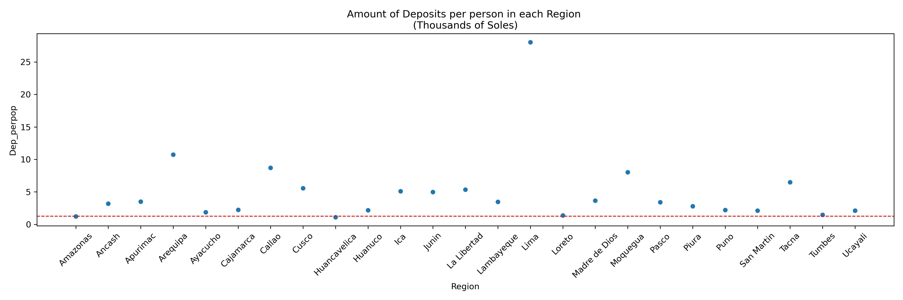

## 2.3 Maps

The maps present similar information to that shown in the previous region-based charts. The shading of each region indicates its population concentration, while the bubbles and their size represent the total amount of credit (or deposits) allocated in that region. The maps reveal a clear concentration of credit and deposit activity in Lima for the banking subsystem, while CMACs display a more regionally diverse presence. Additional map charts can be found at the `Images` folder.

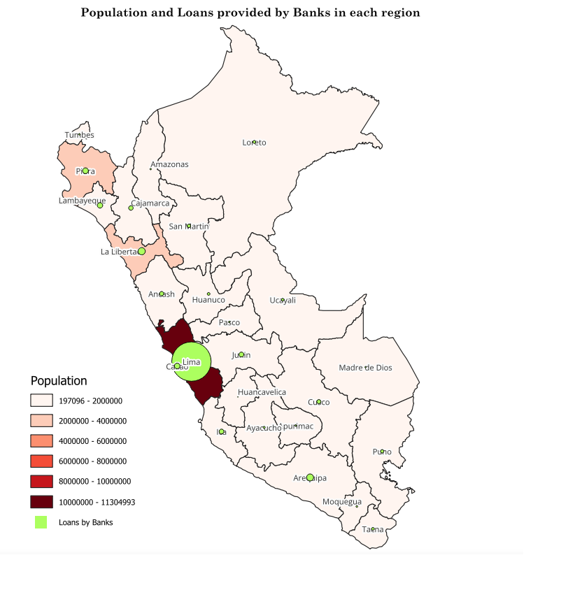
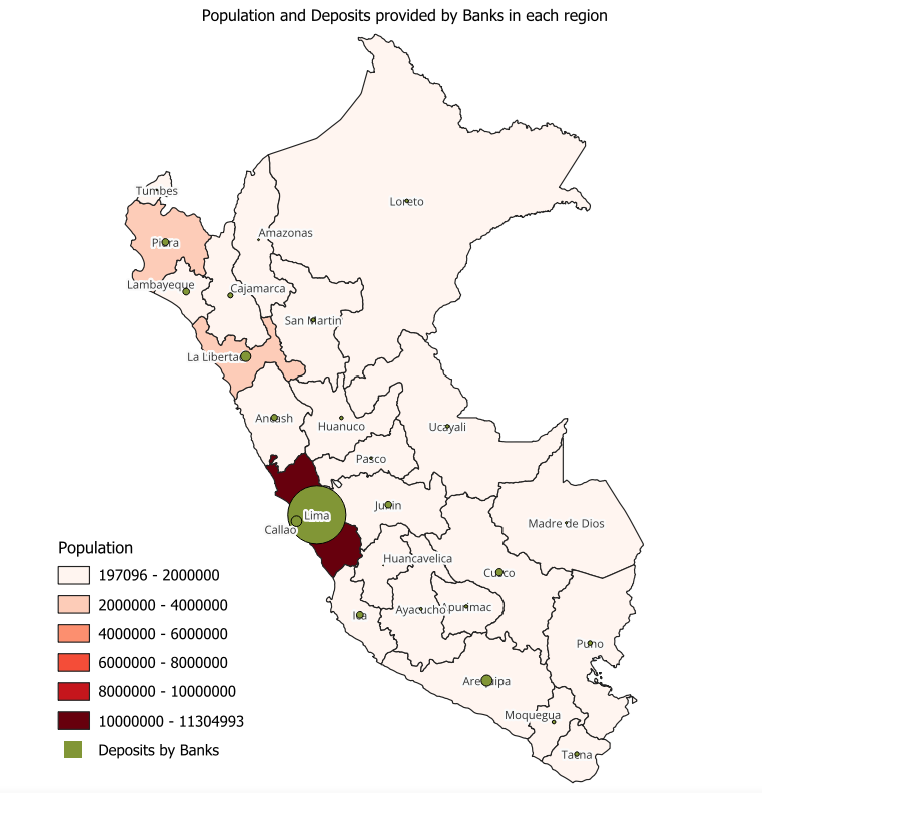
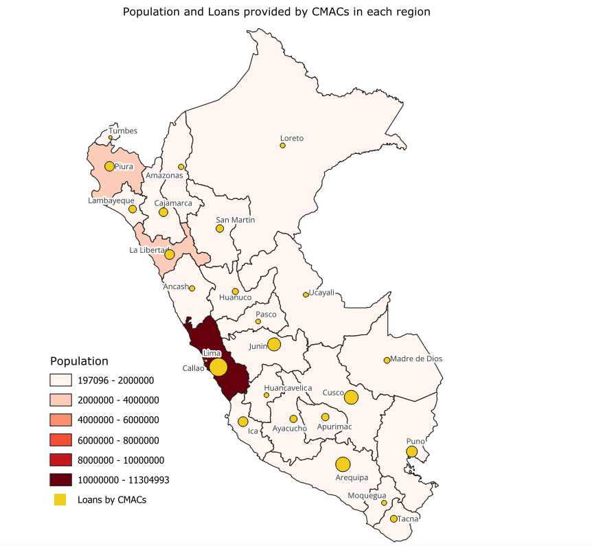
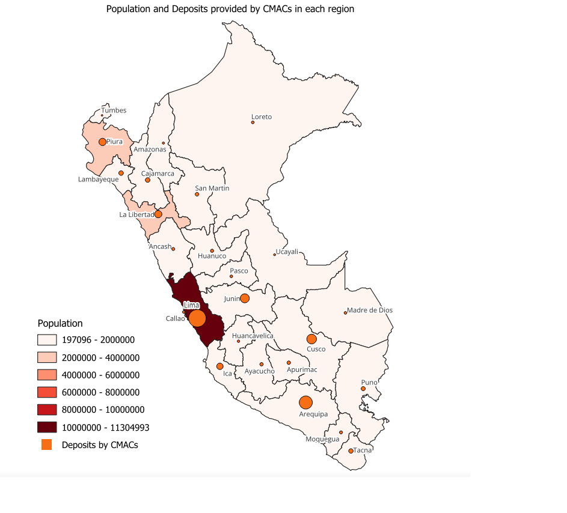

## 3. From de script "ratios.py"

## 3.1 Capital Ratio distribution
This chart shows the distribution of the capital ratio for each financial subsystem. In the case of banking institutions, they generally show a wide distribution, with most capital ratios above 10% (regulatory limit), and several high outliers (exceeding 35%). Financial companies also show healthy capital levels, mostly between 12% and 20%, with fewer outliers than banks. CMACs exhibit a more concentrated range between 13% and 18%, while CRACs have lower average ratios, with more entities near or below the 10% threshold. This may suggest greater vulnerability within this subsystem.

Furthermore, some entities have shown capital ratios below 10%, which serves as a warning sign. It is important to analyze which institutions are involved and why they reported such low levels. In most cases, these are entities that were later closed or required capital strengthening plans.

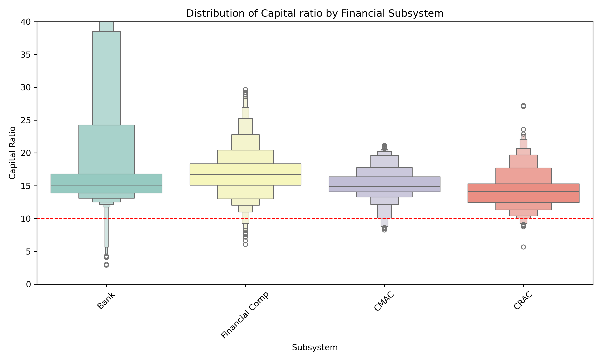

## 3.2 Default Ratio distribution
This chart shows the distribution of the default ratio across each subsystem. As is immediately evident, CRACs generally have higher and more dispersed levels of default compared to the rest. The red dotted line represents the 95th percentile, meaning that firms above this line are considered outliers. Although there is no regulatory limit for default ratios, it is a crucial indicator for triggering early warnings, closely monitoring credit risk in portfolios, and taking prudent measures to preserve credit quality, avoid losses, and improve lending policies.

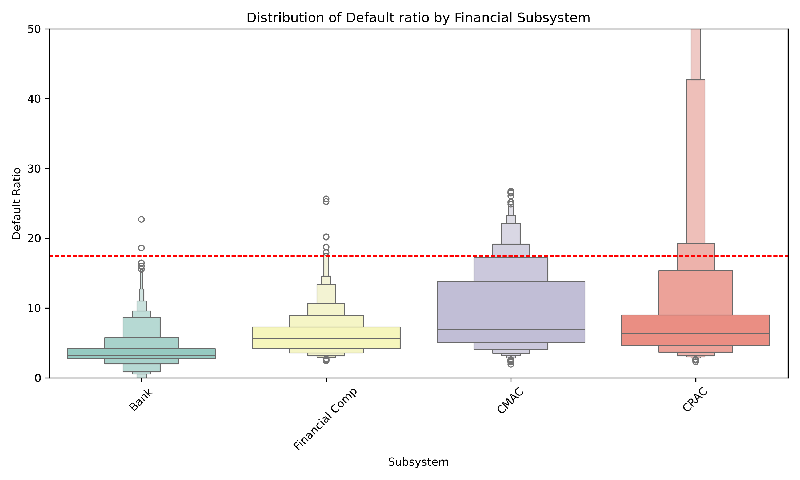

## 3.3. Entity - default ratio evolution

This chart illustrates the case of a CRAC institution that experienced a severe deterioration in its loan portfolio, with a sharp increase in its default rate starting in 2019. Notably, this institution was ultimately closed in September 2021.

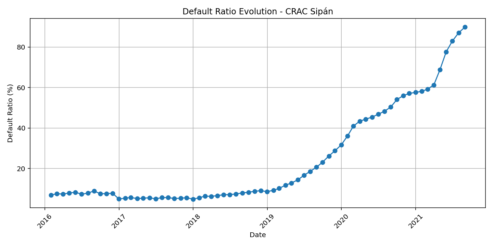

